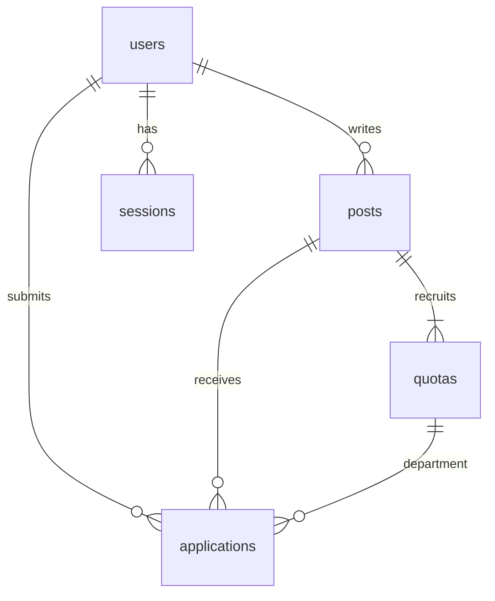

# 캠퍼스 팀업 · Campus Contest Team

**고급웹프로그래밍 과목 프로젝트** — 같은 학교 학생들이 공모전 팀원을 모집하고, 지원서를 검토하여 팀을 구성하는 웹 서비스입니다.

## 기술 구성

- **서버**: Express.js 5, Node.js 24 이상 (ES Modules)
- **화면**: EJS 서버 렌더링, 반응형 CSS, 한국어 UI
- **저장소**: Node.js 내장 SQLite (`node:sqlite`), 외부 DB 설치 불필요
- **인증**: 학교 이메일 인증, scrypt 비밀번호 해시, SQLite 세션
- **메일**: Nodemailer SMTP / 로컬 콘솔 시연 모드

## 실행

```bash
git clone https://github.com/HeeSeoKim-73/campus-contest-team.git
cd campus-contest-team
npm ci
```

`.env.example`을 `.env`로 복사합니다.

```powershell
# Windows PowerShell
Copy-Item .env.example .env
```

```bash
# macOS / Linux
cp .env.example .env
```

```bash
npm start
```

브라우저에서 **http://localhost:3000** 에 접속합니다. 개발 중 자동 재시작은 `npm run dev`, 테스트는 `npm test`입니다. DB와 테이블은 첫 실행 시 `data/campus.sqlite`에 자동 생성됩니다. `.env`, DB, `node_modules`는 Git에 올리지 않습니다.

## 시연 순서

기본 학교 도메인은 **example.ac.kr**로, 실제 학교 정보가 아닙니다. 기본 상태에서 외부에 서비스를 운영하지 마세요.

1. `leader@example.ac.kr`로 회원가입합니다. 비밀번호는 10자 이상입니다.
2. 서버 터미널의 **로컬 시연용 이메일 인증** 링크를 브라우저로 열고 인증 버튼을 누릅니다. 기본 `MAIL_MODE=console`에서는 실제 메일이 전송되지 않습니다.
3. 로그인하여 공고를 작성합니다. 예: 컴퓨터공학과 1명, 디자인학과 1명.
4. 로그아웃하고 `member@example.ac.kr`로 컴퓨터공학과 학생 계정을 가입·인증합니다.
5. 모집 카드에서 공고를 열고 지원 동기와 기술을 작성해 제출합니다.
6. 게시자 계정으로 다시 로그인해 해당 공고의 지원자를 승인합니다.
7. 카드와 상세 화면에 **컴퓨터공학과 1 / 1명**이 표시되는지 확인합니다. 지원자는 **내 활동**에서 승인 여부를 확인합니다.
8. 여러 브라우저 프로필 또는 시크릿 창을 쓰면 게시자와 지원자를 동시에 시연할 수 있습니다.

## 주요 기능과 규칙

| 기능 | 동작 |
|---|---|
| 교내 접근 | 인증된 사용자만 공고·지원 내역에 접근 가능 |
| 학교 인증 | 이메일 도메인 정확히 일치 + 메일 링크 소유 확인 |
| 카드 목록 | 공모전, 제목, 마감일, 학과별 승인 인원 표시 |
| 공고 작성 | 학과별 추가 모집 인원 0~20명 설정; 한 학과 이상 필수 |
| 지원서 | 자기소개·지원 동기, 기술·경험 제출; 가입 학과 자동 반영 |
| 게시자 관리 | 해당 공고 작성자만 지원자 이름·메일·지원서 확인 및 처리 |
| 승인/거절 | 검토 중 → 승인 또는 거절, 처리 이후 재변경 불가 |
| 정원 보호 | 승인 트랜잭션에서 학과별 승인 수와 정원 재확인 |
| 내 활동 | 작성 공고와 본인 지원 결과 확인 |

- **게시자는 추가 모집 정원에 포함되지 않습니다.** 카드 숫자는 승인된 지원자 수입니다.
- 중복 지원, 자기 공고 지원, 모집하지 않는 학과 지원, 정원 초과 승인, 마감 후 신규 지원을 차단합니다.
- 지원 마감일은 **한국 시간 23:59:59까지**입니다. 마감 이후에도 기존 지원서 심사는 가능합니다.
- 지원자 개인정보는 작성자와 본인에게만 표시됩니다. 다른 학생은 학과별 집계만 볼 수 있습니다.
- 인증 링크 유효시간 30분, 세션 24시간. 미인증 계정은 다시 가입해 인증 메일을 재발급할 수 있습니다.
- 다른 사용자의 승인은 서버에서 권한 검사합니다. CSRF 토큰, HttpOnly/SameSite 쿠키, 요청 횟수 제한, EJS 출력 이스케이프, SQL 바인딩 및 Helmet을 적용했습니다.
- 승인 결과는 DB에 즉시 저장되고, 다른 사용자는 페이지를 새로고침하면 갱신된 수치를 봅니다. 실시간 푸시 기능은 포함하지 않습니다.

## 학교 설정과 실제 메일 발송

`.env`에서 `SCHOOL_NAME`, `SCHOOL_EMAIL_DOMAIN`, `DEPARTMENTS`를 학교에 맞게 변경하세요. 학교 이메일 도메인은 `@` 없이 입력합니다. 학과 설정은 실제 가입을 시작하기 전에 확정하세요.

```dotenv
SCHOOL_NAME=학교명
SCHOOL_EMAIL_DOMAIN=학교의실제도메인.ac.kr
DEPARTMENTS=컴퓨터공학과,경영학과,디자인학과
MAIL_MODE=smtp
SMTP_HOST=smtp.example.com
SMTP_PORT=587
SMTP_USER=발송계정
SMTP_PASS=발송계정의앱비밀번호
MAIL_FROM=발신주소
BASE_URL=https://서비스주소
NODE_ENV=production
```

학교 이메일 소유 인증이며 학적 시스템과 연동된 재학 여부 검증은 아닙니다. 재학생만 허용해야 한다면 학교 SSO 또는 학적 확인 연동이 추가로 필요합니다.

운영 모드는 콘솔 인증, 예시 도메인, HTTP 주소, SMTP 필수 설정 누락 시 시작을 거부합니다. HTTPS 리버스 프록시와 지속 저장 디스크가 있는 Node 서버가 필요합니다. SQLite 파일을 여러 서버 인스턴스에 나누어 사용하면 안 됩니다. 기본적으로 프록시의 IP 헤더를 신뢰하지 않으므로 프록시 뒤에서는 요청 제한이 공통 IP로 적용될 수 있습니다. 배포 환경에 맞게 Express `trust proxy`를 검토하세요.

**GitHub 업로드는 소스 코드 보관입니다.** Express 서버는 GitHub Pages에서 실행되지 않으며, 서비스 공개는 별도의 서버 배포가 필요합니다. SMTP 실제 발송은 메일 제공자 설정 후 별도로 확인해야 합니다.

## 구조

```text
src/app.js       라우트, 입력 검증, 학교 인증, 세션
src/db.js        DB 스키마, 학과별 집계, 승인 트랜잭션
src/server.js    서버 시작
views/          EJS 화면
public/         CSS, favicon
test/           HTTP 통합 테스트
.env.example    학교 및 메일 설정 예시
```

## 데이터 모델



`applications`는 `(post_id, user_id)`가 고유하고, `(post_id, department)`가 `quotas`를 참조합니다. 승인 시 `BEGIN IMMEDIATE`로 쓰기 잠금을 획득한 후 기존 상태, 게시자 권한, 정원을 확인하고 갱신합니다.

## 테스트

`npm test`는 임시 메모리 DB와 로컬 HTTP 서버로 다음을 검증합니다.

- 외부 이메일 거부, 미인증 로그인 거부, 일회용 이메일 인증
- 공고 작성 → 지원 → 승인 → 학과별 카운트 반영
- CSRF 누락, 무권한 승인, 중복 지원 및 승인, 다른 학과 지원 차단
- 정원 초과 승인 방지, 거절 결과와 본인 내역 조회
- 마감 후 지원 거부, HTML 삽입 이스케이프, 지원자 개인정보 비공개

## 현재 범위

과제의 핵심 흐름을 구현한 MVP입니다. 비밀번호 재설정, 탈퇴, 학과 변경, 공고 수정·삭제, 지원 취소, 알림 발송, 학교 SSO는 현재 포함하지 않습니다. 실제 운영 전 학교 개인정보 처리 기준과 계정 관리 절차를 정해야 합니다.

참고 문서: [Express 공식 문서](https://expressjs.com/), [Node.js SQLite](https://nodejs.org/api/sqlite.html).
